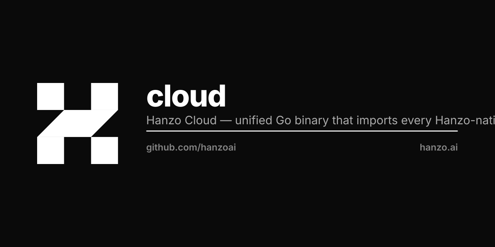

<p align="center"></p>

# cloud

Unified Go control plane and binary for the Hanzo platform (HIP-0106).

[]()
[]()

## Quick start

One binary is the WHOLE Hanzo cloud + console, locally, for testing:

```bash
docker run -p 8080:8080 ghcr.io/hanzoai/cloud:latest
# or from source (Go 1.26):  go build -o cloud ./cmd/cloud && ./cloud
open http://localhost:8080          # the console UI (embedded)
curl http://localhost:8080/v1/ai/health   # the /v1 API — SAME process
```

No external infra required. With no config, every subsystem uses embedded
Base/SQLite under a writable data dir (falls back to `~/.config/hanzo/cloud` when
`/var/lib/cloud` isn't writable) — no Postgres/DO/ClickHouse. Point login at a real
IAM with `CLOUD_IAM_URL=https://hanzo.id` (default is the brand issuer); the binary
proxies `/v1/iam/*` to it same-origin. Override the port with `CLOUD_LISTEN=:9000`.

## What this is

`hanzoai/cloud` is one Go binary that mounts every Hanzo subsystem (iam, kms, base, gateway, ai, commerce, vfs, mq, dns, amqp, mcp, o11y, ...) into a single multi-tenant process. Same artifact serves `api.hanzo.ai`, `api.osage.cloud`, `api.lux.cloud`, `api.zoo.cloud`, and every white-label reseller. Brand, enabled subsystems, and tenant scope are deployment configuration.

## `hanzo` — cloud control CLI

The same binary is also a gcloud/doctl-class CLI. The first token selects the mode:

- `hanzo <subsystem>` — **server mode**: serve a subsystem (`hanzo iam`, `hanzo cloud`, …).
- `hanzo <verb>` — **client mode**: control the live estate. A thin client over
  Hanzo IAM (`hanzo.id`), the platform control plane (`platform.hanzo.ai/v1`),
  and the cloud `/v1` API — it invents no parallel API.

```bash
hanzo login                       # IAM password grant against hanzo.id → token in ~/.hanzo (0600)
hanzo whoami                      # identity from the stored token (--verify hits IAM userinfo)
hanzo apps list                   # platform apps board: declared/running/latest tag + drift + health
hanzo apps get <org>/<app>/<env>  # one app row
hanzo deploy <container> --project <p> --env <e>   # rolling, zero-downtime redeploy
hanzo clusters list|get|create|select|target       # dedicated DOKS cluster lifecycle
hanzo build <repo> --sha <sha> --image        # platform-native (arcd/Kaniko) build, no GitHub builders
hanzo k8s target                  # the org's resolved deploy target (kubeconfig never returned)
hanzo config set <k> <v>          # ~/.hanzo/config preferences
```

Global flags: `--org`, `-o/--output table|json`, `--platform-url`, `--iam-issuer`,
`--platform-token`. Tokens resolve from flag → env → `~/.hanzo` (never hardcoded):
the IAM user token is the identity; the platform control plane is service-token
authed (it cannot validate user tokens), so `apps`/`deploy`/`clusters` use
`--platform-token` / `HANZO_PLATFORM_TOKEN` / `PLATFORM_SERVICE_TOKEN`, and
`build` uses `HANZO_BUILD_TOKEN` / `PLATFORM_BUILD_CALLBACK_TOKEN`.

Install: `go install github.com/hanzoai/cloud/cmd/hanzo@latest`, or `brew install hanzoai/tap/hanzo`.

## Specs

Implements:
- HIP-0014 Application Deployment
- HIP-0026 IAM
- HIP-0027 KMS
- HIP-0037 AI Cloud Platform
- HIP-0105 In-Process Extension Runtime
- HIP-0106 Unified Cloud Binary
- HIP-0302 Encrypted SQLite + ZapDB Durability

## Architecture

```
                 api.{tenant}.{brand}
                          |
                   hanzoai/cloud (one Go binary)
                          |
   +----------+----------+----------+----------+----------+
   |    iam   |   base   |   kms    |    ai    | gateway  | ...
   |  Mount() |  Mount() |  Mount() |  Mount() |  Mount() |
   +----------+----------+----------+----------+----------+
   per-tenant SQLite (HIP-0302)   |   Hanzo IAM JWKS (HIP-0026)
   replicate -> S3 (HIP-0107)     |   ZAP inter-subsystem RPC
```

Every subsystem exposes `func Mount(app *zip.App, deps cloud.Deps) error`. White-label fork pattern: customers fork this repo to launch their own ecosystem.


---

# Hanzo Cloud

The unified Go binary that imports every Hanzo-native subsystem and dispatches
requests per deployment configuration. One artifact, many subsystems.

Per [HIP-0106](https://github.com/hanzoai/HIPs/blob/main/HIPs/hip-0106-unified-hanzo-cloud-binary.md).

## Subsystems mounted

- `iam` — identity & access
- `base` — per-tenant SQLite + extension runtimes (per HIP-0105)
- `kms` — secrets
- `commerce` — checkout, billing, pricing, invoicing (light router; NOT in PCI-DSS scope)
- `ai` — LLM control plane / RAG / model hub / MCP management (was hanzoai/cloud pre-rename)
- `gateway` — HTTP routing + policy
- `o11y` — metrics / traces / logs
- `vfs` — virtual filesystem / object-store abstraction
- `mq` — message queue
- `dns`, `amqp`, `mcp`, `auto`, `tasks`, ... (full list per HIP-0106)

## Deployment modes

Same binary; different startup configuration:

```bash
cloud --enable=iam,base,kms,commerce,ai,gateway,o11y --brand=hanzo  --domain=hanzo.ai
cloud --enable=iam,base,kms,commerce,ai,gateway,o11y --brand=osage  --domain=osage.cloud
cloud --enable=iam,base,kms,commerce,ai,gateway,o11y --brand=lux    --domain=lux.cloud
cloud --enable=iam,base,kms,commerce,ai,gateway,o11y --brand=zoo    --domain=zoo.cloud
```

## White-label fork pattern

Customers fork `hanzoai/cloud` to launch their own ecosystem in one binary. Brand
detection, enabled subsystems, ZAP endpoints (payments / vault backends) are all
deployment configuration.

## Web framework

[hanzoai/zip](https://github.com/hanzoai/zip) — Sinatra-style Go web framework
built on Fiber v3. The ONE Go web framework. No `.Fast` escape hatch.

## Console UI — embedded in the ONE binary

The same `hanzoai/cloud` binary serves the [console](https://github.com/hanzoai/console2)
(`@hanzo/gui`) UI at the web root AND the `/v1` API from one process — one
artifact, one origin, no separate console Service. The UI is compiled in via
`//go:embed` (see `webui.go`).

Pipeline (in the `Dockerfile`, before `go build`):

```
console stage  →  build console2 static bundle  →  /out
      COPY --from=console /out/ → src/webui/dist/     (overlays the fallback shell)
build stage    →  go build   →  //go:embed all:webui/dist bakes it into /cloud
```

Serving (`webui.go`, registered LAST in `Serve` so it never shadows the API):

- `GET /` and any client-side route (`/orgs`, `/models`, …) → the SPA shell
  (`index.html`) with `Cache-Control: no-cache`; fingerprinted assets under
  `assets/`/`_next/` are served `immutable` for a year, with brotli/gzip
  precompressed negotiation when the build emits `.br`/`.gz` siblings.
- `GET /v1/*` (and `/zap`, `/healthz`, …) → the API. Real subsystem routes are
  registered before the console catch-all, so they always win; an **unmatched**
  path under an API prefix returns a real 404 (JSON namespace), never HTML.
- Same-origin: the embedded console calls `/v1` on its own host, so the session
  cookie is first-party — no second origin, no CORS.
- `GET /v1/iam/*` → reverse-proxied to the brand IAM (`CLOUD_IAM_URL`, else the
  brand OIDC issuer). IAM is a separate control plane (not fused), but the console's
  auth + identity calls (get-account, signin, oauth, get-users) resolve same-origin,
  and the IAM session cookie is rewritten host-only so it is first-party to this
  binary. Registered with the health contract, before subsystems, so it wins. See
  `iam_proxy.go`.

`webui/dist/index.html` is a committed **fallback shell** (a real same-origin
`/v1` bootstrap) so `go build` always compiles and the binary always serves a UI
even without the Node toolchain. The image build overwrites `webui/dist` with the
real console bundle. See `webui_test.go` for the boot-and-assert tests
(`/` → shell, deep link → shell 200, `/v1/*` → API, unmatched `/v1` → 404).

> State: console2 (v8.4.9+) is a **static export** (`output: 'export'` → `out/`).
> Its 18 Next BFF server routes were collapsed to same-origin `/v1` — the browser
> calls its OWN origin `/v1/<head>` and this binary serves it directly, validating
> the first-party IAM session cookie (`middleware_identity.go`) and deriving the org
> from the token `owner` claim, so the cross-origin bearer-mint BFF is unnecessary by
> construction. The GUI SPA renders client-only via `dynamic(ssr:false)` (the ~100
> react-native-web product modules can't be server-evaluated), so the export emits
> the shell + fingerprinted assets and the console mounts on the client. `build:embed`
> produces `out/`; the Dockerfile copies it into `webui/dist` before `go build`. The
> separate console2 Service is retired the moment this image rolls out.

## Status

Scaffold. The Mount(app, deps) integration for each subsystem lands per
HIP-0106's migration phases.
